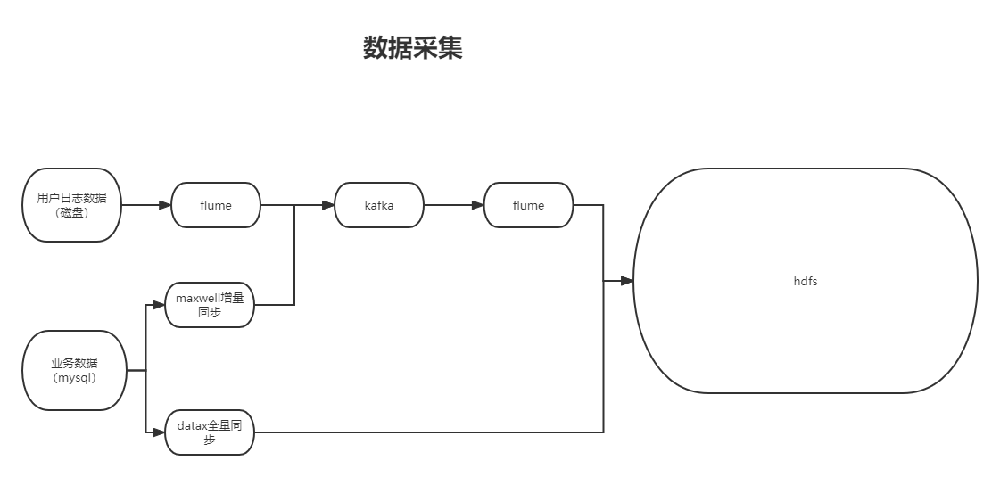
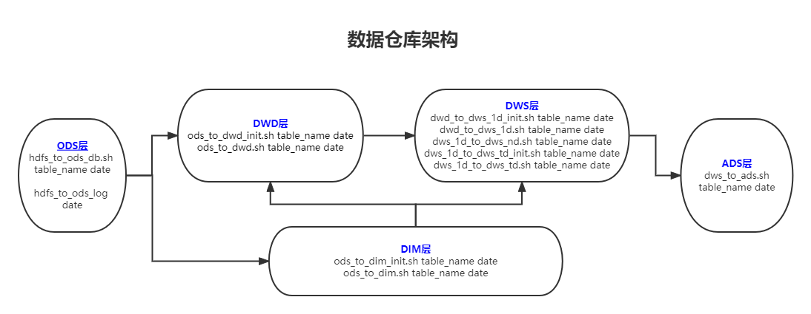
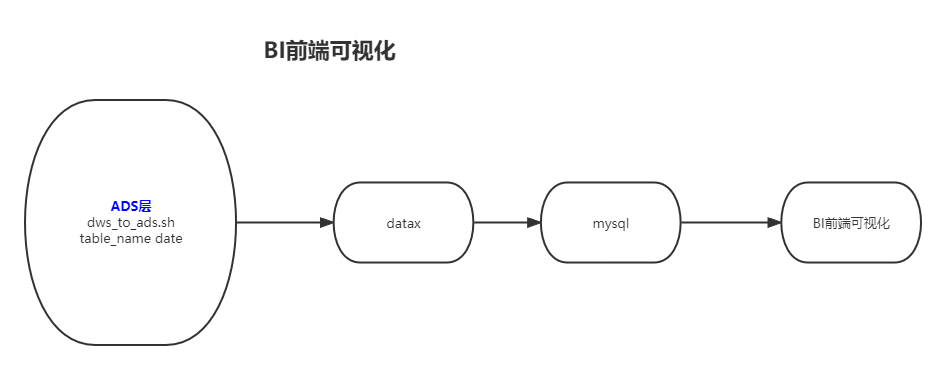

# E-commerce-data-warehouse-V5.0
# 数据仓库

## 整体架构

数据采集：flume，kafka，datax，maxwell

数据存储处理：hive on spark，mysql

#### 数据采集

**架构设计：**

一：用户日志数据

数据源：多台服务器的磁盘

架构：磁盘 --> flume  --> kafka  --> flume --> hdfs

设计思路：用户日志数据分散在各个服务器的磁盘上，需要增量同步到hdfs。如果直接使用 flume --> hdfs，会造成多flume同时访问					hdfs，造成namenode压力过大，小文件问题，可能会有hdfs并发写问题。因此先使用 flume --> kafka，把日志数据收集起					来 ,再 kafka --> flume -->hdfs，上传到hdfs，gzip压缩。

细节：f1(flume1)监控磁盘对应路径，把新数据过滤（非json去除）到kafka的topic_log主题，f2(flume2 )作为kafka消费者，把topic_log中数据，提取log中的时间字段，发送到hdfs对应路径。为避免f2滚动过快，造成hdfs小文件，需要配置hdfs.rollInterval=3600，hdfs.rollSize=134217728，hdfs.rollCount =0。

二：业务数据

数据源：mysql业务数据库

架构：全量表  mysql --> datax -->hdfs    增量表 : mysql --> maxwell --> kafka --> flume

设计思路：业务数据同步到hdfs，有全量表与增量表之分。

​					全量表直接使用datax同步到hdfs对应日期

activity_info，activity_rule，base_category1，base_category2，base_category3，base_dic，base_province，base_region，base_trademark，cart_info，coupon_info，sku_attr_value，sku_info，sku_sale_attr_value，spu_info，

​					增量表使用maxwell监控13张表mydql的binlog，发送到对应kafka的topic_table，f3（flume3）监控kafka13个topic，把对					应topic数据提取时间戳后发送到hdfs对应路径

  cart_info,  comment_info,  coupon_use,  favor_info,  order_detail,  order_detail_activity,  order_detail_coupon,  order_info,  order_refund_info,  order_status_log,  payment_info,  refund_payment,  user_info

### 数据仓库

整体架构：

采用维度建模，星型模型

事实表围绕业务过程建表，包含与该业务过程有关的维度引用（维度表外键）以及该业务过程的度量（通常是可累加的数字类型字段）。

设计事务事实表时一般可遵循以下四个步骤：

选择业务过程→声明粒度→确认维度→确认事实

维度表则围绕业务过程所处的环境进行设计。维度表主要包含一个主键和各种维度字段，维度字段称为维度属性。

确定维度（表）→ 确定主维表和相关维表 → 确定维度属性 

##### ODS层

把hdfs文件以表形式存储到hive中，log数据增量同步到ods_log_inc中，db数据分为全量表与增量表存到对应ods表中。

**DIM层**

存放维度模型中的维度表，保存一致性的维度信息。

设计：商品维度表，优惠券维度表，活动维度表，地区维度表以日期分区，增量同步

日期维度表为手动导入，通常一次性导入一整年

用户维度表以拉链表形式存储。每个日期存储当天过期的用户维度。同时为了方便查询使用与更新，还要维护一个处于有效期内的用户维度表。

实现细节：商品维度表，优惠券维度表，活动维度表，地区维度表只需要从ODS简单提取装载

用户维度表实现思路：full outer join，old和new均有的代表是更新，把更新的old数据dt设为昨日日期，没有更新的与insert的一起dt为'9999-12-31'，使用动态分区一次加入对应分区

**DWD层**

把ODS层数据处理，经过维度退化，加入到明细层。通常一个业务过程对应一张事实表。

DIM层的数据存储格式为orc列式存储+snappy压缩

实现细节：

使用date_format(）函数处理ts转化为对应时区时间。

使用DECIMAL()函数处理浮点数的格式

由于CBO优化的bug，当对集合类型struct()、array()、map()使用判空时，会出现过滤失效。

两种解决方案：一：临时关闭CBO优化set hive.cbo.enable=false;	二：对集合类型中非空必然出现的字段等判空。

#当需要对集合类型中的字段属性进行排序时，不可以直接order by struck.attr，即使是使用子查询，也会出现报错。因为order by需要对表的字段进行排序。此时可以使用CTE,with nick_name as (),

#提取出想要排序的集合内字段，再排序？？？？？？？？？？？

流量域页面浏览事务事实表中，实现session划分，需要order by mid_id,ts，再把page_last_id为null的行视为session起始行,新列值为1，其余设为0，sum()则为session。

**DWS层**

根据业务需求，把重复的分析过程，业务过程相同、统计粒度相同、统计周期相同的分析过程集合，形成DWS层。减少重复计算。

对业务过程相同，统计粒度相同，聚合逻辑相同，但是仅仅是统计周期不同的计算，有以下几个优化思路：

根据统计周期，分为1/7/30天，因此可以先统计1d，再由1d去计算7/30 d的数据。

可以根据不同的统计周期，分别where过滤出对应数据进行统计后union all ，动态分区装入表，亦可一次提取出最大统计周期的数据，使用if(,,)或case when then else end进行优化代码。

使用lateral view explode（array（1,7,30）），把数据炸裂为三份并标记上对应分区，先group by 分区再按原来逻辑计算。

**ADS层**

为业务需求提供数据支持。存放各种指标统计结果。

### 全流程调度

由于脚本需要每日定时调度，可以使用Oozie,DolphinScheduler等任务调度器。

### BI前端可视化

由于直接使用hive对ADS层查询实时性不好，延迟较高，加上ADS层数据量通常不大，因此使用datax把ADS层数据导入到mysql等关系型数据库。

